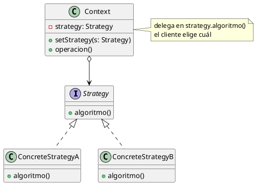
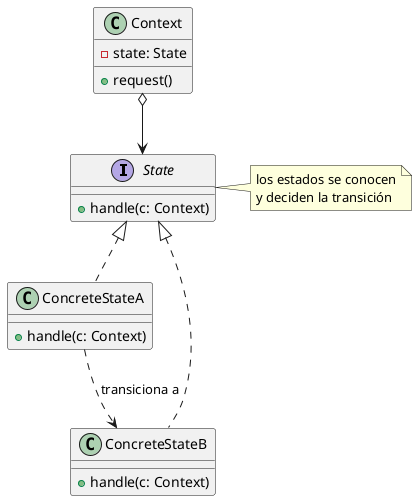
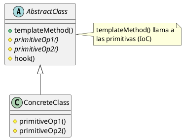
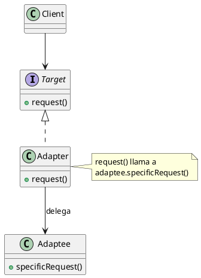
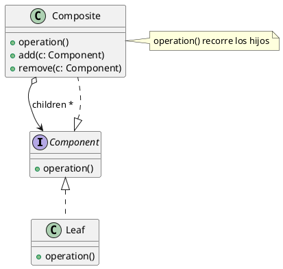
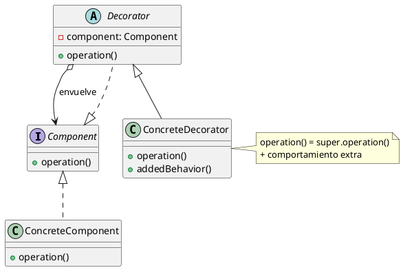
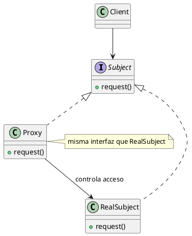
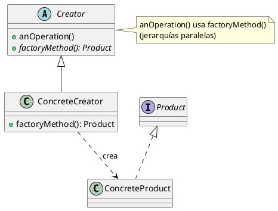
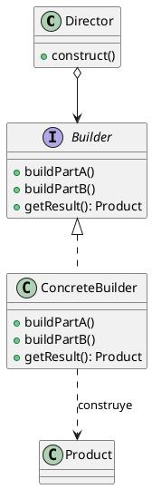

# Machete — Patrones de diseño (OO2, cátedra Garrido)

> **Qué recordar SIEMPRE de un patrón (lo pidió la cátedra):**
> 1. **Propósito / Intención**
> 2. **Estructura** → roles (clases), cómo se relacionan (herencia / interfaces /
     >    métodos abstractos / composición-conocimiento)
> 3. **Variantes de implementación**
> 4. **Consecuencias** (positivas y negativas)
> 5. **Relación con otros patrones**
>
> ⚠️ Las que más se olvidan y MÁS caen en promoción: **consecuencias** y **relación con otros**.

---

## Patrones vistos

| Patrón | Tipo | Intención (1 línea) |
|---|---|---|
| **Adapter** | Estructural | Adaptar la interfaz de una clase a otra que el cliente espera |
| **Template Method** | Comportamiento | Definir el esqueleto de un algoritmo, dejando pasos a las subclases |
| **Strategy** | Comportamiento | Familia de algoritmos intercambiables, independientes entre sí |
| **State** | Comportamiento | Cambiar el comportamiento de un objeto según su estado interno |
| **Composite** | Estructural | Tratar objetos individuales y composiciones de forma uniforme (árbol) |
| **Decorator** | Estructural | Agregar responsabilidades a un objeto dinámicamente (wrapper) |
| **Proxy** | Estructural | Un sustituto que controla el acceso a otro objeto (wrapper) |
| **Factory Method** | Creacional | Delegar a subclases qué clase concreta instanciar |
| **Builder** | Creacional | Separar la construcción de un objeto complejo de su representación |

---

## Roles por patrón (⚠️ acá se pierden puntos)

### Strategy
- **Context**: tiene una referencia a una Strategy y la usa. (ej. `Reporte`)
- **Strategy**: interfaz/abstracción del algoritmo. (ej. `Exportador`)
- **ConcreteStrategy**: cada algoritmo concreto. (ej. `ExportadorPDF`, `ExportadorCSV`)

> El Context **NO** es la Strategy. El Context **conoce** y **elige** la strategy.

### State
- **Context**: delega en el estado actual; se abstrae de qué State concreto es.
- **State**: interfaz del estado.
- **ConcreteState**: cada estado; **decide la transición** al siguiente.

### Template Method
- **AbstractClass**: define el `templateMethod()` (esqueleto) + operaciones primitivas (abstractas) + hooks.
- **ConcreteClass**: implementa las operaciones primitivas.

### Adapter
- **Target**: interfaz que el cliente espera.
- **Adapter**: implementa Target y traduce las llamadas.
- **Adaptee**: la clase con la interfaz incompatible.

### Composite
- **Component**: interfaz común (hojas y compuestos).
- **Leaf**: objeto individual (sin hijos).
- **Composite**: tiene hijos (Components) y delega en ellos.

### Decorator
- **Component**: interfaz común.
- **ConcreteComponent**: objeto base a decorar.
- **Decorator**: implementa Component y **tiene** un Component (envuelve).
- **ConcreteDecorator**: agrega la responsabilidad extra.

### Factory Method
- **Creator**: declara el `factoryMethod()` (abstracto) y lo usa en `anOperation()`.
- **ConcreteCreator**: implementa el factoryMethod → `return new ConcreteProduct`.
- **Product / ConcreteProduct**: lo que se crea.

### Builder
- **Director**: conoce el proceso de construcción; llama a los pasos del Builder en orden (`construct()`).
- **Builder**: interfaz abstracta con los pasos de construcción (`buildPartA()`, `buildPartB()`, `getResult()`).
- **ConcreteBuilder**: implementa los pasos y ensambla el producto; sabe devolver el resultado (`getResult()`).
- **Product**: el objeto complejo que se construye.

> Director = "qué pasos y en qué orden"; ConcreteBuilder = "cómo se hace cada paso".
> El mismo Director + distintos ConcreteBuilder = distintas representaciones del producto.

### Tipos de Proxy (según qué acceso controlan)
- **Virtual Proxy**: retrasa la creación de un objeto costoso hasta que se necesita
  de verdad (lazy load). Ej: no cargar una imagen pesada hasta que se va a mostrar.
- **Remote Proxy**: representa localmente un objeto que vive en otra máquina/proceso;
  oculta la comunicación de red. El cliente lo usa como si fuera local.
- **Protection Proxy**: controla el acceso según permisos; deja pasar o no según
  quién llama. Ej: el ejercicio de protección de acceso a la base de datos.

> Los tres tienen la MISMA interfaz que el RealSubject y deciden si/cuándo/cómo
> delegarle. Cambia el motivo del control (costo, ubicación, permisos).

---

## Diagramas de estructura (PlantUML)

> Genéricos (roles + relaciones), no ejemplos. Notación:
> `<|--` herencia · `<|..` implementa interfaz · `-->` conoce/asocia ·
> `o-->` agregación · `*-->` composición · `..>` crea/usa

### Strategy

### State

### Template Method

### Adapter (object adapter)

### Composite

### Decorator

### Proxy

### Factory Method

### Builder

---

## ⚠️ Distinciones que SE TOMAN

### Strategy vs State (¡la estrella!)
| | **Strategy** | **State** |
|---|---|---|
| Mismo diagrama | sí | sí |
| ¿Los concretos se conocen entre sí? | **NO**, independientes | **SÍ**, un State decide el siguiente |
| ¿Quién cambia el concreto? | el **cliente/contexto**, explícito | **transición interna**, dinámica |
| ¿El contexto sabe cuál usa? | sí, lo **elige** | se **abstrae**, no debería enterarse |
| Concepto | algoritmos intercambiables | máquina de estados |

### Adapter vs Decorator vs Proxy (los 3 wrappers)
Todos envuelven un objeto, diagramas similares, **propósito distinto**:

| | Interfaz que ofrece | Propósito |
|---|---|---|
| **Adapter** | **distinta** a la del objeto | hacer compatible una interfaz |
| **Decorator** | la **misma** + responsabilidades | agregar comportamiento dinámicamente |
| **Proxy** | la **misma** | controlar el acceso (lazy, remoto, protección) |

### Factory Method vs Builder
- **Factory Method:** suele aparecer con **jerarquías paralelas** (Creator ↔ Product).
- **Builder:** separa **construcción** de **representación**; el mismo proceso puede
  construir representaciones distintas. No hay jerarquías paralelas.

---

## Relación con otros patrones (para promoción)

- **Strategy ↔ Adapter:** una ConcreteStrategy puede necesitar un Adapter si el
  algoritmo concreto tiene otra interfaz (ej. encriptación TEA/RC4).
- **Strategy ↔ Template Method:** dentro de una ConcreteStrategy puede aparecer un
  Template Method.
- **Composite ↔ Decorator:** estructuras similares; Decorator = Composite con un
  solo hijo + responsabilidad agregada.
- **Factory Method:** aparece para crear los productos de otros patrones.

---

## Patrón ↔ Refactoring (Refactoring to Patterns)
> "Los patrones son **a dónde** querés llegar; los refactorings, **el camino**."

| Refactoring to Pattern | Lleva a |
|---|---|
| Form Template Method | Template Method |
| Extract Adapter | Adapter |
| Replace Implicit Tree with Composite | Composite |
| Replace Conditional Logic with Strategy | Strategy |
| Replace State-Altering Conditionals with State | State |
| Move Embellishment to Decorator | Decorator |

> ⚠️ No refactorizar hacia un patrón "por las dudas" → eso es **Speculative Generality**.
> Se va al patrón cuando el diseño actual **frena** un cambio concreto.

---

## Validar que un patrón está BIEN aplicado (no solo que "funciona")
- ¿Cada clase cumple el **rol** correcto del patrón?
- ¿Se respeta el **propósito** (no solo la estructura)?
  Ej: usar Strategy donde los "algoritmos" se conocen entre sí → **mal**, eso es State.
- ¿El contexto sabe **lo justo** (en State, no debería conocer los concretos)?
- ¿Hay una **alternativa mejor**? (Strategy vs State vs Template Method, etc.)