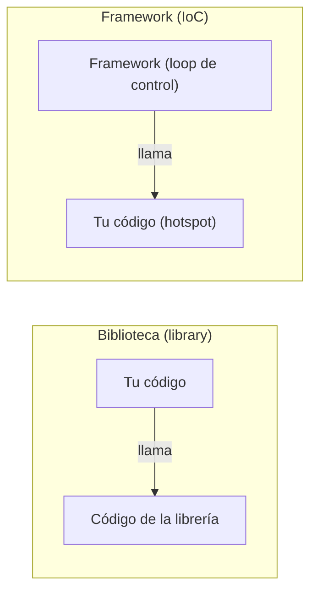

# Machete — Frameworks (OO2, cátedra Garrido)

> **Framework =** solución reusable para una **familia de aplicaciones**. Las clases
> del framework ya resuelven la mayor parte del problema; **el código del framework
> controla/usa al código de la instanciación**.
>
> - **Instanciación(Framework) = Aplicación / Solución**
> - **Extensión(Framework) = Framework'**

---

## 1. Inversión de Control (IoC) — concepto central

En una **biblioteca (library):** **vos** llamás al código de la librería.
En un **framework:** el **framework** llama a **tu** código.

- **Principio de Hollywood:** *"No nos llames, nosotros te llamamos."*
  El framework tiene el hilo de control y, en algún punto, invoca el método que
  **vos** definiste (ej. `handleMessage(...)`).
- Ej. `EchoServer`: `startLoop(args)` arranca el loop del framework (toma el
  control). El loop, en algún punto, llama a `handleMessage(...)` que vos definiste.

---

## 2. Hot Spot vs Frozen Spot

| | **Hot Spot** | **Frozen Spot** |
|---|---|---|
| Qué es | parte **flexible**: permite modificar el comportamiento (para instanciar o extender) | parte **fija**: afecta a TODAS las instanciaciones, **no se puede modificar** ("marca indeleble") |
| Quién lo completa | el desarrollador que instancia/extiende | nadie, es parte de la arquitectura |
| Ejemplo (`SingleThreadTCPServer`) | la condición de cierre **si** fuera parametrizable (política de cierre) | el cierre `if (inputLine.equals(""))` hardcodeado en líneas 72-74 |

---

## 3. White Box vs Black Box (las 2 formas de extender)

| | **White Box (herencia)** | **Black Box (composición)** |
|---|---|---|
| Cómo se extiende | **subclasificar** y completar métodos abstractos / hooks | **componer** con objetos ya hechos, configurar |
| Hilo de control | se **hereda** y se completa | el framework ya lo tiene; vos enchufás objetos |
| Conocimiento interno requerido | **más** (hay que conocer el código del framework) | **menos** (interfaz/contratos) |
| Flexibilidad | más potente, más acoplado | más simple/seguro, más limitado a lo que provee |
| Encapsulamiento | bajo (ves las tripas) | alto (caja cerrada) |

> Regla: **herencia → caja blanca → más conocimiento interno.**
> **composición → caja negra → menos conocimiento interno.**

---

## 4. Preguntas tipo cátedra (para practicar sobre un framework dado)

> *No nos van a pedir armar un framework: nos dan uno y lo modificamos/analizamos.*

Para cualquier framework que te den, sabé responder:
- **Para instanciarlo:** ¿qué clases subclasifico o qué objetos compongo? ¿qué
  métodos defino?
- **Para extenderlo:** ídem, ¿qué agrego?
- **¿Cuánto necesito conocer la estructura interna** para instanciar? ¿y para extender?
- **Identificar hotspots y frozen spots.**
- **¿Hay inversión de control? ¿Dónde se produce** en cada forma de implementación?
- **Si hay muchas configuraciones posibles** → conviene **composición** (black box),
  no una explosión de subclases.

### Ojo con la "explosión de subclases" (hotspots por herencia)
Si cada combinación de variantes (ej. fuente de energía × locomoción × arma) exige
una subclase nueva, agregar **una** variante obliga a crear **muchas** clases
(producto cartesiano). → señal de que conviene **composición**.

---

## 5. Frase para el parcial
- IoC = el framework controla el flujo y llama a tu código (Hollywood).
- Library = vos llamás; Framework = te llaman.
- Hot spot = flexible (lo completás). Frozen spot = fijo (marca de todas las apps).
- Herencia = white box = más conocimiento. Composición = black box = menos.
