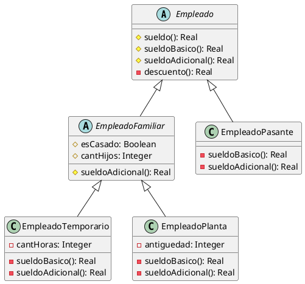

# Cálculo de sueldos

## Diagrama de clases



## Implementación en Java

```java

public abstract class Empleado{

    protected abstract double sueldoBasico();
    
    protected abstract double sueldoAdicional();
    
    private double descuento(){
        return this.sueldoBasico() * 0.13 + this.sueldoAdicional() * 0.05;
    }

    protected double sueldo(){
        return sueldoBasico() + sueldoAdicional() - descuento();
    }
}

public abstract class EmpleadoFamiliar extends Empleado{
    protected boolean esCasado;
    protected int cantHijos;
    
    @Override
    protected double sueldoAdicional() {
        return (esCasado ? 5000 : 0) + cantHijos * 2000;
    }
}

public class EmpleadoPasante() extends Empleado{
    private int cantExamen;

    @Override
    private double sueldoBasico(){ return 20000; }

    @Override
    private double sueldoAdicional(){ return 2000 * cantExamen; }
}

public class EmpleadoTemporario extends EmpleadoFamiliar {
    private int cantHoras;
    
    @Override
    private double sueldoBasico() { 
        return 20000 + 300 * cantHoras;
    }
}

public class EmpleadoPlanta extends EmpleadoFamiliar {
    private int antiguedad;
    
    @Override
    private double sueldoBasico() { return 50000; }
    
    @Override
    private double sueldoAdicional() {
        return super.sueldoAdicional() + 2000 * antiguedad;
    }
}
```

## Patrón utilizado : Template Method
### Roles
- AbstractClass : Empleado
- ConcreteClass : EmpleadoPasante, EmpleadoPlanta, EmpleadoTemporario
- templateMethod(): # sueldo() // llama a las primitivas, hooks helpers y realiza IoC
- primitiveOp(): sueldoBasico() // abstracta (la subclase DEBE implementar)
- hook(): sueldoAdicional() // tiene default (la subclase PUEDE redefinir)
- helper(): descuento() // no es abstracta ni se redefine