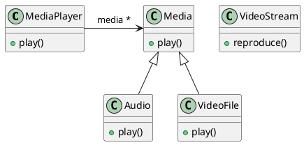
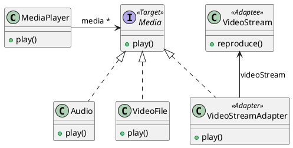

# Ejercicio 3: Media Player


## Diagrama de clases dado:



## Tareas:
### Modifique el diagrama de clases UML para considerar los cambios necesarios. Si utiliza patrones de diseño indique los roles en las clases utilizando estereotipos.

Se utiliza el patrón de diseño Adapter:



### Implemente en Java

```java

public class MediaPlayer {
    private List<Media> media;
    
    public void play() {
        media.stream()
                .map( m -> m.play() );
    }
}


public interface Media {
    void play();
}

public class Audio implements Media {
    @Override
    public void play() { /* reproduce audio */ }
}

public class VideoFile implements Media {
    @Override
    public void play() { /* reproduce Video */ }
}

public class VideoStream {
    public void reproduce() { /* reproduce videoStream */ }
}

public class VideoStreamAdapter implements Media {
    private VideoStream videoStream;
    @Override
    public void play() { videoStream.reproduce(); }
}

```


## Dudas
Con estereotipos se refiere a <<Abstract>> por ejemplo, no?

Por qué cuando como una nuez y una almendra por separado saben bien, pero cuando como las dos al mismo tiempo saben feo y amargo?