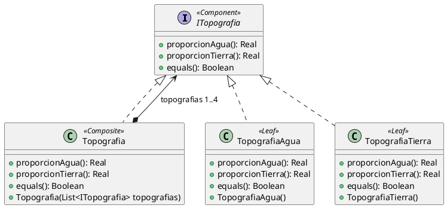

# Ejercicio 4: Topografías

## Tareas:
### Diseñe e implemente las clases necesarias para que sea posible:
1. crear Topografías,
2. calcular su proporción de agua y tierra,
3. comparar igualdad entre topografías. Dos topografías son iguales si tienen exactamente la misma composición. Es decir, son iguales las proporciones de agua y tierra, y además, para aquellas que son mixtas, la disposición de sus partes es igual.
Pista: notar que la definición de igualdad para topografías mixtas corresponde exactamente a la misma que implementan las listas en Java. https://docs.oracle.com/javase/8/docs/api/java/util/AbstractList.html#equals-java.lang.Object-

#### Diagrama de clases



#### Implementación en Java

```java

import java.util.ArrayList;
import java.util.stream.Collectors;

public interface ITopografia {
    double proporcionAgua();

    double proporcionTierra();

    boolean equals(ITopografia topografia);
}

public class Topografia implements ITopografia {

    private List<ITopografia> topografias;

    public Topografia(List<ITopografia> topografias) {
        this.topografias = new ArrayList<>(topografias);
    }

    @Override
    public double proporcionAgua() {
        return topografias.stream()
                .mapToDouble(t -> t.proporcionAgua())
                .average().orElse(0);
    }
    
    @Override
    public double proporcionTierra() {
        return topografias.stream()
                .mapToDouble(t -> t.proporcionTierra())
                .average().orElse(0);
    }
    
    @Override
    public boolean equals(ITopografia topografia){
        if(topografias == null && topografia == null) return true;
        else if(topografias == null || topografia == null) return false;
        else return topografias.stream()
                .allMatch(t -> t.equals(topografia));
    }
}

public class TopografiaAgua implements ITopografia {
    @Override
    public double proporcionAgua(){ return 1; }
    
    @Override
    public double proporcionTierra(){ return 0; }
    
    @Override
    public boolean equals(ITopografia topografia){
        return (this.proporcionAgua() == topografia.proporcionAgua()) && (this.proporcionTierra() == topografia.proporcionTierra()); 
    }
}

public class TopografiaTierra implements ITopografia {
    
    @Override
    public double proporcionAgua(){ return 0; }
    
    @Override
    public double proporcionTierra(){ return 1; }
    
    @Override
    public boolean equals(ITopografia topografia) {
        return (this.proporcionAgua() == topografia.proporcionAgua()) && (this.proporcionTierra() == topografia.proporcionTierra());
    }
}
```

### Diseñe e implemente test cases para probar la funcionalidad implementada. Incluya en el set up de los tests, la topografía compuesta del ejemplo. 

```java

public class TopografiaTest {
    
    Topografia topografiaMixtaC, topografiaMixtaD, topografiaTierra, topografiaAgua;

    @BeforeEach
    public void setUp(){   
        topografiaMixtaC = new Topografia(
                List.of(
                        new TopografiaAgua(),
                        new TopografiaTierra(), 
                        new TopografiaTierra(), 
                        new TopografiaAgua()
                )
        );

        topografiaMixtaD = new Topografia(
                List.of(
                        new TopografiaAgua(),
                        new TopografiaTierra(),
                        new TopografiaTierra(),
                        new Topografia(
                                List.of(
                                        new TopografiaAgua(),
                                        new TopografiaTierra(),
                                        new TopografiaTierra(),
                                        new TopografiaAgua()
                                )
                        )
                )
        );
        
        topografiaAgua = new Topografia(
                List.of(
                        new TopografiaAgua(),
                        new TopografiaAgua(),
                        new TopografiaAgua(),
                        new TopografiaAgua()
                )
        );
        
        topografiaTierra = new Topografia(
                List.of(
                        new TopografiaTierra(),
                        new TopografiaTierra(),
                        new TopografiaTierra(),
                        new TopografiaTierra()
                )
        );
    }
    
    @Test
    public testEquals(){
        assertTrue(topografiaMixtaC.equals(topografiaMixtaC));
        assertFalse(topografiaMixtaC.equals(topografiaMixtaD));
        assertTrue(topografiaAgua.equals(topografiaAgua));
        assertTrue(topografiaTierra.equals(topografiaTierra));
        assertFalse(topografiaAgua.equals(topografiaTierra));
        assertFalse(topografiaTierra.equals(topografiaAgua));
    }
}
```