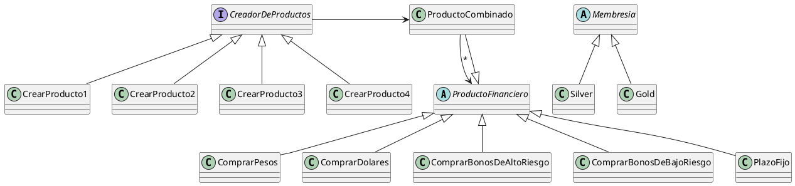

```plantuml
@startuml

abstract class ProductoFinanciero{} 

interface CreadorDeProductos{}

class CrearProducto1
class CrearProducto2
class CrearProducto3
class CrearProducto4

class ComprarPesos{}

class ComprarDolares{}

class ComprarBonosDeAltoRiesgo
class ComprarBonosDeBajoRiesgo
class PlazoFijo
class ProductoCombinado

abstract class Membresia
class Silver
class Gold

Membresia <|-- Silver
Membresia <|-- Gold


ProductoFinanciero <|-- ComprarPesos
ProductoFinanciero <|-- ComprarDolares
ProductoFinanciero <|-- ComprarBonosDeAltoRiesgo
ProductoFinanciero <|-- ComprarBonosDeBajoRiesgo
ProductoFinanciero <|-- PlazoFijo
ProductoFinanciero <|-- ProductoCombinado


CreadorDeProductos <|-- CrearProducto1 
CreadorDeProductos <|-- CrearProducto2
CreadorDeProductos <|-- CrearProducto3 
CreadorDeProductos <|-- CrearProducto4 


CreadorDeProductos -> ProductoCombinado
ProductoCombinado --> ProductoFinanciero: *

@enduml
```