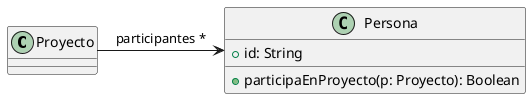
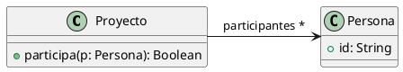

# Ejercicio 1: Algo huele mal
Indique qué malos olores se presentan en los siguientes ejemplos.

## 1.1 Protocolo de Cliente
La clase Cliente tiene el siguiente protocolo. ¿Cómo puede mejorarlo?

```java
/**
* Retorna el límite de crédito del cliente
*/
  public double lmtCrdt() {...}
/**
* Retorna el monto facturado al cliente desde la fecha f1 a la fecha f2
*/
  protected double mtFcE(LocalDate f1, LocalDate f2) {...}

/**
* Retorna el monto cobrado al cliente desde la fecha f1 a la fecha f2
*/
  private double mtCbE(LocalDate f1, LocalDate f2) {...}
```
### Solución
A simple vista esta clase sufre de los code smell Uncommunicative Name y Comments para sus métodos. la forma de mejorarlo es renombrando todos sus métodos a nombres más descriptivos y completos, sin abreviaturas, para poder sacar los comentarios.

```java
public double getLimiteCreditoCliente() {...}

protected double montoFacturadoAlClienteEn(LocalDate f1, LocalDate f2) {...}

private double montoCobradoAlClienteEn(LocalDate f1, LocalDate f2) {...}
```

## 1.2 Participación en proyectos 
Al revisar el siguiente diseño inicial (Figura 1), se decidió realizar un cambio para evitar lo que se consideraba un mal olor. El diseño modificado se muestra en la Figura 2. Indique qué tipo de cambio se realizó y si lo considera apropiado. Justifique su respuesta.

### Diseño inicial:

```java
public boolean participaEnProyecto(Proyecto p){
    return p.getParticipantes().contains(this);
}
```

### Diseño revisado:


```java
public boolean participa(Persona p){
    return participantes.contains(p);
}
```

### Respuesta

Dado que en el diseño inicial se tenía el bad smell Feature Envy, se realizó el refactoring Move Method. Este consiste en implementar a su vez Rename Method, Remove Parameter y Add Parameter. El cambio me parece adecuado ya que la clase Persona estaba realizando la responsabilidad que le correspondía a Proyecto al tener esa clase el atributo necesario.

## 1.3 Cálculos
Analice el código que se muestra a continuación. Indique qué code smells encuentra y cómo pueden corregirse.

### Respuesta
Los code smells encontrados son Long Method, Imperative Loops, Temporary Fields. Para corregir el Long Method se puede aplicar Replace temp with Query y Extract Method

```java
public void imprimirValores() {
	double promedioEdades = this.calcularPromedioEdades();
	double totalSalarios = 0;
	
	for (Empleado empleado : personal) {
		totalEdades = totalEdades + empleado.getEdad();
		totalSalarios = totalSalarios + empleado.getSalario();
	}
	promedioEdades = totalEdades / personal.size();
		
	String message = String.format("El promedio de las edades es %s y el total de salarios es %s", promedioEdades, totalSalarios);
	
	System.out.println(message);
}

public double calcularPromedioEdades(){
    int totalEdades = 0;
    
    personal.stream()
            . //TODO: Continuar!!
    for(Empleado empleado : personal){
        totalEdades += empleado.getEdad();
    }
    
    return totalEdades / personal.size();
}
```

