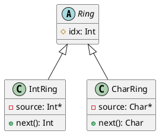

# Ejercicio 3: Iteradores circulares bis

Se cuenta con las siguientes implementaciones de iteradores circulares, las cuales presentan implementaciones similares. 

```java
public class CharRing{
    private char[] source;
    private int idx;
    
    public CharRing(String src){
        source = src.toCharArray();
        idx = 0;
    }
    
    public char next(){
        if(idx >= source.length) idx = 0;
        return source[idx++];
    }
}
```

```java
public class IntRing{
    private int[] source;
    private int idx;
    
    public IntRing(int[] src){
        source = src;
        idx = 0;
    }
    
    public int next(){
        if(idx >= source.length) idx = 0;
        return source[idx++];
    }
}
```

1) Tests de unidad:
```java
import org.junit.jupiter.api.BeforeEach;
import org.junit.jupiter.api.Test;
import static org.junit.jupiter.api.Assertions.assertEquals;

public class IntRingTest {

    IntRing intRing;

    @BeforeEach
    public void setUp() {
        intRing = new IntRing(new int[]{1,2,3,4,5});
    }

    @Test
    public void testNext(){
        assertEquals(1, intRing.next());
        assertEquals(2, intRing.next());
        assertEquals(3, intRing.next());
        assertEquals(4, intRing.next());
        assertEquals(5, intRing.next());
        assertEquals(1, intRing.next());
    }

}
```

```java
import org.junit.jupiter.api.BeforeEach;
import org.junit.jupiter.api.Test;

import static org.junit.jupiter.api.Assertions.assertEquals;

public class CharRingTest {

    CharRing charRing;

    @BeforeEach
    public void setUp(){
        charRing = new CharRing("Hola Mundo!");
    }

    @Test
    public void testNext(){
        assertEquals('H', charRing.next());
        assertEquals('o', charRing.next());
        assertEquals('l', charRing.next());
        assertEquals('a', charRing.next());
        assertEquals(' ', charRing.next());
        assertEquals('M', charRing.next());
        assertEquals('u', charRing.next());
        assertEquals('n', charRing.next());
        assertEquals('d', charRing.next());
        assertEquals('o', charRing.next());
        assertEquals('!', charRing.next());
        assertEquals('H', charRing.next());
    }
}
```

2) Aplicar Refactoring Extract Superclass:
   1) Crear una clase abstracta vacía (Ring en mi caso)
   2) Hacer que las clases originales (CharRing e IntRing) sean subclases de la nueva clase abstracta
   3) Aplicar Pull Up Field para idx
      1. Inspeccionar todos los usos de los candidatos y asegurarse que se usan de la misma forma.
      2. Como ya tienen el mismo nombre no hace falta renombrarlos
      3. Crear el atributo idx en la superclase Ring como protected, ya que era privado
      4. Eliminar el atributo idx de las subclases
      5. Compilar y Testear
   4) Al intentar realizar Pull Up Method se observa que no es posible ya que cada implementación es única

3) Volver a correr los tests para ver si todo sigue igual

4) Diagrama de Clases UML:



