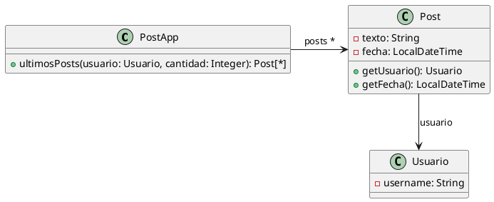

# Ejercicio 6.3: Publicaciones



```java
/**
* Retorna los últimos N posts que no pertenecen al usuario user
*/
public List<Post> ultimosPosts(Usuario user, int cantidad) {
        
    List<Post> postsOtrosUsuarios = new ArrayList<Post>();
    for (Post post : this.posts) {
        if (!post.getUsuario().equals(user)) {
            postsOtrosUsuarios.add(post);
        }
    }
        
   // ordena los posts por fecha
   for (int i = 0; i < postsOtrosUsuarios.size(); i++) {
       int masNuevo = i;
       for(int j= i +1; j < postsOtrosUsuarios.size(); j++) {
           if (postsOtrosUsuarios.get(j).getFecha().isAfter(
     postsOtrosUsuarios.get(masNuevo).getFecha())) {
              masNuevo = j;
           }    
       }
      Post unPost = postsOtrosUsuarios.set(i,postsOtrosUsuarios.get(masNuevo));
      postsOtrosUsuarios.set(masNuevo, unPost);    
   }
        
    List<Post> ultimosPosts = new ArrayList<Post>();
    int index = 0;
    Iterator<Post> postIterator = postsOtrosUsuarios.iterator();
    while (postIterator.hasNext() &&  index < cantidad) {
        ultimosPosts.add(postIterator.next());
    }
    return ultimosPosts;
}
```

## Iteración 1

**(i) Code Smell: Long Method + Comments**

El método `ultimosPosts` hace tres cosas distintas, cada una señalada por un comentario explicativo:
1. Filtra los posts que no pertenecen al usuario
2. Ordena la lista por fecha (implementando selection sort a mano)
3. Toma los primeros N elementos

Los comentarios `// ordena los posts por fecha` y el bloque de filtrado no documentado son una señal de que cada sección merecería su propio método. Además, el `while` tiene un bug: `index` nunca se incrementa.

**(ii) Refactoring: Extract Method**

Se extrae cada bloque lógico en un método privado con nombre descriptivo.

**(iii) Resultado:**

```java
public List<Post> ultimosPosts(Usuario user, int cantidad) {
    List<Post> filtrados = postsDeOtrosUsuarios(user);
    List<Post> ordenados = ordenarPorFechaDesc(filtrados);
    return tomarPrimeros(ordenados, cantidad);
}

private List<Post> postsDeOtrosUsuarios(Usuario user) {
    List<Post> resultado = new ArrayList<>();
    for (Post post : this.posts) {
        if (!post.getUsuario().equals(user)) {
            resultado.add(post);
        }
    }
    return resultado;
}

private List<Post> ordenarPorFechaDesc(List<Post> posts) {
    for (int i = 0; i < posts.size(); i++) {
        int masNuevo = i;
        for (int j = i + 1; j < posts.size(); j++) {
            if (posts.get(j).getFecha().isAfter(posts.get(masNuevo).getFecha())) {
                masNuevo = j;
            }
        }
        Post unPost = posts.set(i, posts.get(masNuevo));
        posts.set(masNuevo, unPost);
    }
    return posts;
}

private List<Post> tomarPrimeros(List<Post> posts, int cantidad) {
    List<Post> resultado = new ArrayList<>();
    int index = 0;
    Iterator<Post> it = posts.iterator();
    while (it.hasNext() && index < cantidad) {
        resultado.add(it.next());
        index++;
    }
    return resultado;
}
```

---

## Iteración 2

**(i) Code Smell: Imperative Loops**

Los tres métodos extraídos usan bucles imperativos (`for`, `while`) para operaciones que son directamente expresables como pipelines funcionales con la Stream API de Java. Esto hace el código más difícil de leer y más propenso a errores (como el bug del `index` original).

**(ii) Refactoring: Replace Loop with Pipeline**

Se reemplaza cada bucle por la operación de stream equivalente:
- Filtrado → `.filter()`
- Ordenamiento → `.sorted()` con `Comparator`
- Tomar N → `.limit()`

**(iii) Resultado:**

```java
public List<Post> ultimosPosts(Usuario user, int cantidad) {
    return this.posts.stream()
        .filter(post -> !post.getUsuario().equals(user))
        .sorted(Comparator.comparing(Post::getFecha).reversed())
        .limit(cantidad)
        .collect(Collectors.toList());
}
```

El método resultante no tiene más malos olores: es corto, sin comentarios necesarios, sin variables temporales, y su intención es clara. No se detectan nuevos code smells.