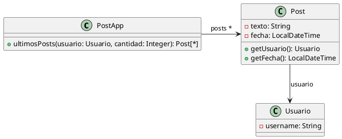

# Ejercicio 6.3: Publicaciones



```java
/**
* Retorna los últimos N posts que no pertenecen al usuario user
*/
public List<Post> ultimosPosts(Usuario user, int cantidad) {
        
    List<Post> postsOtrosUsuarios = new ArrayList<Post>();
    for (Post post : this.posts) {
        if (!post.getUsuario().equals(user)) {
            postsOtrosUsuarios.add(post);
        }
    }
   // ordena los posts por fecha
   for (int i = 0; i < postsOtrosUsuarios.size(); i++) {
       int masNuevo = i;
       for(int j= i +1; j < postsOtrosUsuarios.size(); j++) {
           if (postsOtrosUsuarios.get(j).getFecha().isAfter(
     postsOtrosUsuarios.get(masNuevo).getFecha())) {
              masNuevo = j;
           }    
       }
      Post unPost = postsOtrosUsuarios.set(i,postsOtrosUsuarios.get(masNuevo));
      postsOtrosUsuarios.set(masNuevo, unPost);    
   }
        
    List<Post> ultimosPosts = new ArrayList<Post>();
    int index = 0;
    Iterator<Post> postIterator = postsOtrosUsuarios.iterator();
    while (postIterator.hasNext() &&  index < cantidad) {
        ultimosPosts.add(postIterator.next());
    }
    return ultimosPosts;
}
```

## Iteración 1

### Code Smell: Long Method

El método ultimosPosts hace tres cosas distintas, con una señalada por un comentario explicativo (síntoma del long method):
1. Filtra los posts que no pertenecen al usuario
2. Ordena la lista por fecha (implementando selection sort a mano)
3. Toma los primeros "cantidad" elementos (Contiene un bug dentro del While)

Los comentarios `// ordena los posts por fecha` y el bloque de filtrado no documentado son una señal de que cada sección merecería su propio método.

### Refactoring: Extract Method

Se aplica el refactoring Extract Method sobre el bloque de código de filtrado:
1. Crear un método con el nombre postsDeOtrosUsuarios().
2. Las variables que necesita son Usuario user (parámetro) y List<Post> posts (v.i de la clase por lo que se accede con this).
3. Debe retornar una sola cosa: List<Post>.
4. Mover el código al cuerpo del método.
5. Llamar al método en donde antes estaba el código guardando el resultado en una variable.
6. Compilar y ejecutar.

### Resultado:

```java
private List<Post> postsDeOtrosUsuarios(Usuario user){
    List<Post> postsOtrosUsuarios = new ArrayList<Post>();
    for (Post post : this.posts) {
        if (!post.getUsuario().equals(user)) {
            postsOtrosUsuarios.add(post);
        }
    }
    return postsOtrosUsuarios;
}

/**
* Retorna los últimos N posts que no pertenecen al usuario user
*/
public List<Post> ultimosPosts(Usuario user, int cantidad) {

    List<Post> postsOtrosUsuarios = postsDeOtrosUsuarios(user);

    // ordena los posts por fecha
   for (int i = 0; i < postsOtrosUsuarios.size(); i++) {
       int masNuevo = i;
       for(int j= i +1; j < postsOtrosUsuarios.size(); j++) {
           if (postsOtrosUsuarios.get(j).getFecha().isAfter(
     postsOtrosUsuarios.get(masNuevo).getFecha())) {
              masNuevo = j;
           }    
       }
      Post unPost = postsOtrosUsuarios.set(i,postsOtrosUsuarios.get(masNuevo));
      postsOtrosUsuarios.set(masNuevo, unPost);    
   }
        
    List<Post> ultimosPosts = new ArrayList<Post>();
    int index = 0;
    Iterator<Post> postIterator = postsOtrosUsuarios.iterator();
    while (postIterator.hasNext() &&  index < cantidad) {
        ultimosPosts.add(postIterator.next());
    }
    return ultimosPosts;
}
```

## Iteración 2
### Code Smell: Long Method
Se continúa teniendo un método largo con aún 2 responsabilidades que se pueden separar

### Refactoring: Extract Method
Se aplica Extract Method sobre el bloque que ordena los posts por fechas (que un bloque tenga un comentario explicativo es señal de que puede necesitar ser extraido)

1. Crear un método con el nombre ordenarPorFechaDesc().
2. Las variables que necesita el método son variables locales al método y métodos de una Lista<Post> por lo que necesita un parámetro Lista<Post>.
3. Debe retornar una sola cosa: List<Post> (copia ordenada de la lista recibida por parámetro).
4. Mover bloque de código al cuerpo del método, adaptar las referencias al nombre de los parámetros.
5. Llamar al método en donde estaba antes el bloque de código guardando lo que retorna en una variable.
6. Borrar el comentario descriptivo.
7. Compilar y testear.

### Resultado:

```java
private List<Post> postsDeOtrosUsuarios(Usuario user){
    List<Post> postsOtrosUsuarios = new ArrayList<Post>();
    for (Post post : this.posts) {
        if (!post.getUsuario().equals(user)) {
            postsOtrosUsuarios.add(post);
        }
    }
    return postsOtrosUsuarios;
}

private List<Post> ordenarPorFechaDesc(List<Post> lista){
    List<Post> posts = new ArrayList<>(lista);
            
    for (int i = 0; i < posts.size(); i++) {
        int masNuevo = i;
        for(int j= i +1; j < posts.size(); j++) {
            if (posts.get(j).getFecha().isAfter(
                    posts.get(masNuevo).getFecha())) {
                masNuevo = j;
            }
        }
        Post unPost = posts.set(i,posts.get(masNuevo));
        posts.set(masNuevo, unPost);
    }
    return posts;
}
/**
* Retorna los últimos N posts que no pertenecen al usuario user
*/
public List<Post> ultimosPosts(Usuario user, int cantidad) {

    List<Post> postsOtrosUsuarios = postsDeOtrosUsuarios(user);
    List<Post> postsOrdenados = ordenarPorFechaDesc(postsOtrosUsuarios);
    
    List<Post> ultimosPosts = new ArrayList<Post>();
    int index = 0;
    Iterator<Post> postIterator = postsOrdenados.iterator();
    while (postIterator.hasNext() &&  index < cantidad) {
        ultimosPosts.add(postIterator.next());
    }
    return ultimosPosts;
}
```

## Iteración 3
### Code Smell: Long Method
Se sigue detectando una responsabilidad que se puede extraer del método largo.

### Refactoring: Extract Method
Se aplica Extract Method al bloque de código que se debería quedar con los N últimos posts, al contener este un bug se procede sin solucionarlo por definición de Refactoring.
1. Crear un método con el nombre devolverUltimosPosts()
2. Las variables que necesita el método son la cantidad de posts a devolver (parámetro), una List<Post> (parámetro) y una List<Post> local al método.
3. Debe devolver una List<Post>, al haber un bug en el código original va a devolver una copia de la lista que recibió
4. Mover el bloque de código al cuerpo del método adaptar las referencias a los nombres de los parámetros
5. Llamar al método en donde estaba anteriormente el bloque de código guardando lo que retorna en una variable o retornándola al ser el último paso del método original
6. Compilar y testear

### Resultado

```java
private List<Post> postsDeOtrosUsuarios(Usuario user){
    List<Post> postsOtrosUsuarios = new ArrayList<Post>();
    for (Post post : this.posts) {
        if (!post.getUsuario().equals(user)) {
            postsOtrosUsuarios.add(post);
        }
    }
    return postsOtrosUsuarios;
}

private List<Post> ordenarPorFechaDesc(List<Post> lista){
    List<Post> posts = new ArrayList<>(lista);
            
    for (int i = 0; i < posts.size(); i++) {
        int masNuevo = i;
        for(int j= i +1; j < posts.size(); j++) {
            if (posts.get(j).getFecha().isAfter(
                    posts.get(masNuevo).getFecha())) {
                masNuevo = j;
            }
        }
        Post unPost = posts.set(i,posts.get(masNuevo));
        posts.set(masNuevo, unPost);
    }
    return posts;
}

private List<Post> devolverUltimosPosts(int cantidad, List<Post> posts){
    List<Post> ultimosPosts = new ArrayList<Post>();
    int index = 0;
    Iterator<Post> postIterator = posts.iterator();
    while (postIterator.hasNext() &&  index < cantidad) {
        ultimosPosts.add(postIterator.next());
    }
    return ultimosPosts;
}

/**
* Retorna los últimos N posts que no pertenecen al usuario user
*/
public List<Post> ultimosPosts(Usuario user, int cantidad) {
    List<Post> postsOtrosUsuarios = postsDeOtrosUsuarios(user);
    List<Post> postsOrdenados = ordenarPorFechaDesc(postsOtrosUsuarios);
    return devolverUltimosPosts(cantidad, postsOrdenados);
}
```

## Iteración 4
### Code Smell: Imperative Loops
Solucionado el Long Method de ultimosPosts, ahora se detecta Imperative Loops en los métodos extraídos. Utilizan bucles For y aplican de forma manual un Selection Sort en lugar de utilizar la librería de Streams de Java

### Refactoring: Replace Imperative Loops with Pipeline
Dado que los 3 métodos extraídos usan bucles imperativos (for y while) para expresiones totalmente representables con pipelines de la API de Streams de Java. 
1. Reemplazar la primera expresión con .filter() dado que realiza un filtrado.
2. Compilar y testear.

### Resultado
```java
private List<Post> postsDeOtrosUsuarios(Usuario user){
    return this.posts.stream()
            .filter(post -> ! post.getUsuario().equals(user))
            .collect(Collectors.toList());
}

private List<Post> ordenarPorFechaDesc(List<Post> lista){
    List<Post> posts = new ArrayList<>(lista);
            
    for (int i = 0; i < posts.size(); i++) {
        int masNuevo = i;
        for(int j= i +1; j < posts.size(); j++) {
            if (posts.get(j).getFecha().isAfter(
                    posts.get(masNuevo).getFecha())) {
                masNuevo = j;
            }
        }
        Post unPost = posts.set(i,posts.get(masNuevo));
        posts.set(masNuevo, unPost);
    }
    return posts;
}

private List<Post> devolverUltimosPosts(int cantidad, List<Post> posts){
    List<Post> ultimosPosts = new ArrayList<Post>();
    int index = 0;
    Iterator<Post> postIterator = posts.iterator();
    while (postIterator.hasNext() &&  index < cantidad) {
        ultimosPosts.add(postIterator.next());
    }
    return ultimosPosts;
}

/**
* Retorna los últimos N posts que no pertenecen al usuario user
*/
public List<Post> ultimosPosts(Usuario user, int cantidad) {
    List<Post> postsOtrosUsuarios = postsDeOtrosUsuarios(user);
    List<Post> postsOrdenados = ordenarPorFechaDesc(postsOtrosUsuarios);
    return devolverUltimosPosts(cantidad, postsOrdenados);
}
```

## Iteración 5
### Code Smell: Imperative Loops
Dado que todavía hay 2 métodos que utilizan bucles imperativos.

### Refactoring: Replace Imperative Loops with Pipeline
1. Reemplazar el método que realiza un Ordenamiento por .sorted(Comparator.comparing())
2. Compilar y testear.

### Resultado
```java
private List<Post> postsDeOtrosUsuarios(Usuario user){
    return this.posts.stream()
            .filter(post -> ! post.getUsuario().equals(user))
            .collect(Collectors.toList());
}

private List<Post> ordenarPorFechaDesc(List<Post> lista){
    return lista.stream()
            .sorted(Comparator.comparing(Post::getFecha).reversed())
            .collect(Collectors.toList());
}

private List<Post> devolverUltimosPosts(int cantidad, List<Post> posts){
    List<Post> ultimosPosts = new ArrayList<Post>();
    int index = 0;
    Iterator<Post> postIterator = posts.iterator();
    while (postIterator.hasNext() &&  index < cantidad) {
        ultimosPosts.add(postIterator.next());
    }
    return ultimosPosts;
}

/**
* Retorna los últimos N posts que no pertenecen al usuario user
*/
public List<Post> ultimosPosts(Usuario user, int cantidad) {
    List<Post> postsOtrosUsuarios = postsDeOtrosUsuarios(user);
    List<Post> postsOrdenados = ordenarPorFechaDesc(postsOtrosUsuarios);
    return devolverUltimosPosts(cantidad, postsOrdenados);
}
```

Queda un Imperative Loop en devolverUltimosPosts, pero contiene un bug preexistente (index no se incrementa, ignora cantidad). Refactorizarlo a .limit(cantidad) cambiaría el comportamiento → no es refactoring. El arreglo del bug es un cambio aparte; una vez corregido, este bloque se reemplazaría por .limit(cantidad).