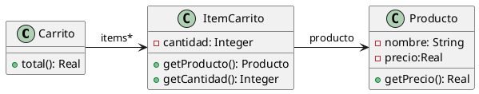

# Ejercicio 6.4 Carrito de compras



```java
public class Producto {
    private String nombre;
    private double precio;
    
    public double getPrecio(){
        return this.precio;
    }
}

public class ItemCarrito {
    private Producto producto;
    private int cantidad;
    
    public Producto getProducto(){
        return this.producto;
    }
    
    public int getCantidad(){
        return this.cantidad;
    }
}

public class Carrito {
    private List<ItemCarrito> items;
    
    public double total(){
        return this.items.stream()
                .mapToDouble(item ->
                    item.getProducto().getPrecio() * item.getCantidad())
                .sum();
    }
}
```

## Code Smell: Feature envy
Feature Envy en la clase Carrito ya que el método total() le pide a ItemCarrito cada producto y calcula por su cuenta el precio por cantidad, cosa que debería delegarse a la clase ItemCarrito.

## Refactoring: Move Method
Se aplica primero un Extract Method para separar el cálculo del stream. Luego ese método se mueve a ItemCarrito que es el que tiene la cantidad y puede saber el producto. Hay varias opciones, pero la mejor a mi parecer es aplicar un Move Method más y copiar el método en Producto pero esta vez con la cantidad como parámetro para que en base a una cantidad devuelva el total.

## Resultado:
```java
public class Producto {
    private String nombre;
    private double precio;
    
    public double getPrecio(){
        return this.precio;
    }
    
    public double calcularTotal(int cantidad){
        return cantidad * this.precio;
    }
}

public class ItemCarrito {
    private Producto producto;
    private int cantidad;
    
    public Producto getProducto(){
        return this.producto;
    }
    
    public double calcularTotal(){
        return this.producto.calcularTotal(this.cantidad);
    }
    
    public int getCantidad(){
        return this.cantidad;
    }
}

public class Carrito {
    private List<ItemCarrito> items;
    
    public double total(){
        return this.items.stream()
                .mapToDouble(item ->
                    item.calcularTotal())
                .sum();
    }
}
```
