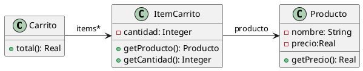

# Ejercicio 6.4 Carrito de compras



```java
public class Producto {
    private String nombre;
    private double precio;
    
    public double getPrecio(){
        return this.precio;
    }
}

public class ItemCarrito {
    private Producto producto;
    private int cantidad;
    
    public Producto getProducto(){
        return this.producto;
    }
    
    public int getCantidad(){
        return this.cantidad;
    }
}

public class Carrito {
    private List<ItemCarrito> items;
    
    public double total(){
        return this.items.stream()
                .mapToDouble(item ->
                    item.getProducto().getPrecio() * item.getCantidad())
                .sum();
    }
}
```

## Iteración 1

**(i) Code Smell: Feature Envy**

El método `total()` de la clase Carrito pide el producto y luego a el producto le pide el precio. Así que se ve como está más interesado en la clase Producto más que en sí mismo.

**(ii) Refactorings: Extract Method, Move Method y Remove Method**

Primero se extrae la parte envidiosa del método `item.getProducto().getPrecio() * item.getCantidad()` a un método llamado `precioTotal()`, luego se mueve este método a la clase ItemCarrito con el mismo nombre, al notar que aún sigue habiendo envidia de atributos, se crea el método `precioTotal(int cantidad)` en la clase Producto que devuelve la multiplicación que ItemCarrito necesita para devolver el precioTotal. Luego de compilar se procede a eliminar todos los métodos que ya no son necesarios.

**(iii) Resultado**
```java
public class Producto {
    private String nombre;
    private double precio;
        
    public double precioTotal(int cantidad){
        return cantidad * this.getPrecio();
    }    
}

public class ItemCarrito {
    private Producto producto;
    private int cantidad;
    
    public Producto getProducto(){
        return this.producto;
    }
    
    public int getCantidad(){
        return this.cantidad;
    }
}

public class Carrito {
    private List<ItemCarrito> items;
    
    public double total(){
        return this.items.stream()
                .mapToDouble(item ->
                    item.getProducto().getPrecio() * item.getCantidad())
                .sum();
    }
}
```

